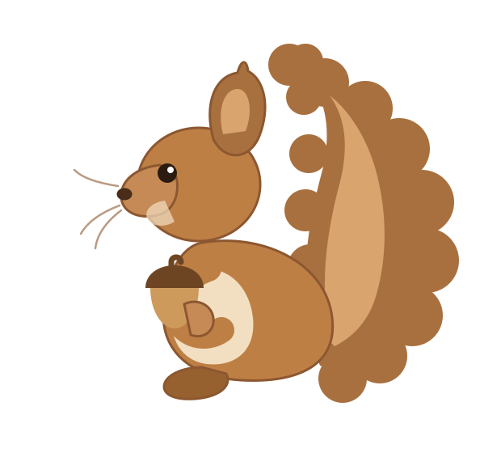

  

### Hi, I'm dockerai09gcp 👋

I work on **data platforms on Google Cloud** — ELT pipelines, orchestration,
and the infrastructure-as-code that keeps them reproducible.

<!-- ^ Replace with your own words, and set your display name at
     https://github.com/settings/profile so this reads as a person. -->

### What I'm digging into

| | |
| :-- | :-- |
| **ELT on GCP** | dbt transformations running on Cloud Run, orchestrated with Cloud Composer, catalogued and governed in Dataplex. |
| **Pipelines as code** | Airflow DAGs provisioned end-to-end with Terraform, so an environment can be torn down and rebuilt from scratch. |
| **Security analytics** | Turning log and audit data into something you can actually query and alert on. |

### Toolbox

`GCP` · `BigQuery` · `dbt` · `Airflow / Composer` · `Cloud Run` · `Dataplex` · `Terraform` · `Docker` · `Python` · `SQL`

<!-- Deliberately no stats/streak/trophy cards here — with a new account they
     render a row of zeros, which reads worse than leaving them out. Add them
     once the numbers are worth showing. -->

<!-- Fill in and uncomment when you want them public:
### Elsewhere
- [LinkedIn](https://www.linkedin.com/in/your-handle)
-->
